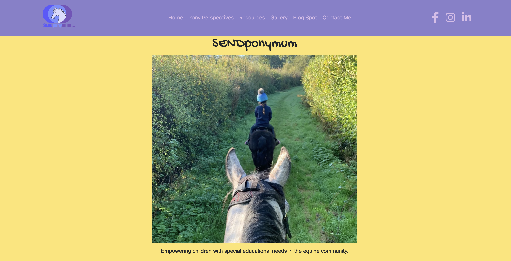
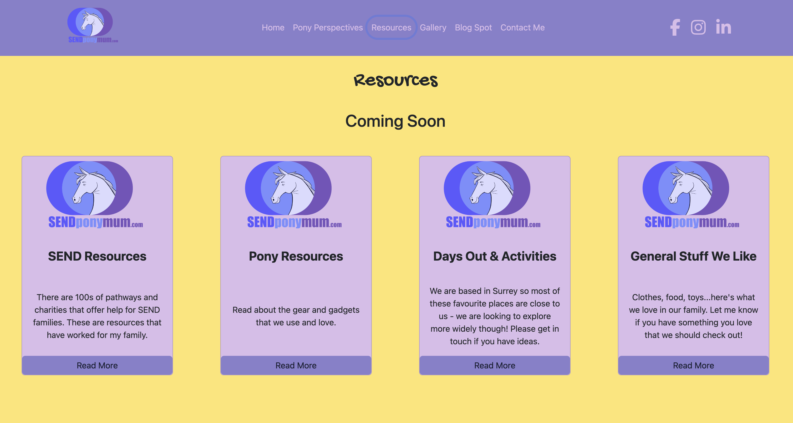
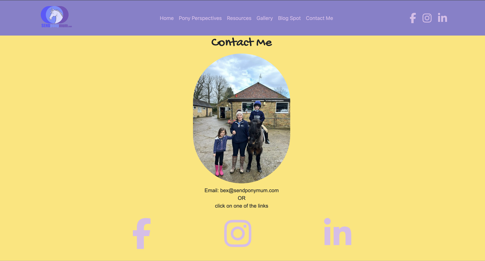

# SENDponymum

## Overview

SENDponymum is dedicated to empowering children with special educational needs within the equine community. Founded by Rebecca Moore, a devoted mother and advocate, this platform serves as a beacon of support and information. Here, families can find resources, share experiences, and connect with a community that understands their unique journeys.

## Mission

Our mission is to provide an accessible space where families of children with special educational needs can explore the benefits of equine therapy, share their stories, and find community support. We strive to offer up-to-date information and personal anecdotes that make the equine therapy journey informative and enriching.

[](https://opensource.org/licenses/MIT)

Portfolio built on


using


Technologies, frameworks and libraries used include:


## Getting Started

To get a local copy up and running follow these simple steps.

### Prerequisites

- npm

    ```sh
  npm install npm@latest -g

### Installation

1 Clone the repo

```git clone https://github.com/yourusername/SENDponymum.git```

2 Install NPM packages

```npm install```

### Running the React App Locally

- Once the installation is complete, run npm start to start the development server.
- Open your web browser and visit [localhost:5173](http://localhost:5173) to view the SENDponymum website.

## Usage

Landing Page


Resources


Gallery Page


Contact Page


## Contact

- Rebecca Moore - [bex@sendponymum.com](mailto:bex@sendponymum.com)
- Project Link: [SENDponymum](https://sendponymum.vercel.app/)

## Developer Contact

For any questions, comments, or inquiries related to the development of the Kernow Pets website, please feel free to reach out to the developer, Alana Barrett-Frew:

- My Portfolio Site [alanabarrettfrew.com](https://alanabarrettfrew.com)
- Find me on GitHub: [AlanaBF](https://github.com/AlanaBF)
- Email: [alanabarrett-frew@hotmail.com](mailto:alanabarrett-frew@hotmail.com)

## License

*This project is licensed under* [MIT](https://choosealicense.com/licenses/mit/)

## Questions

*Contact Alana Barrett-Frew if you have any questions or need to report a problem. Alternatively open an issue.*

## Acknowledgements

- All the families and practitioners contributing their stories and expertise to this project.
